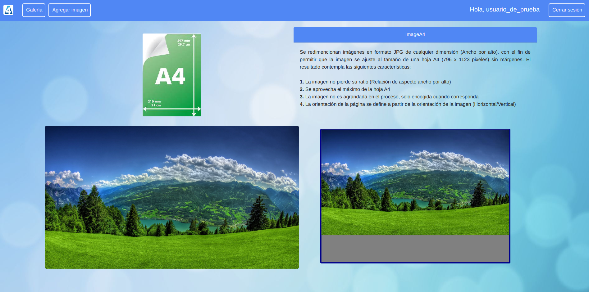
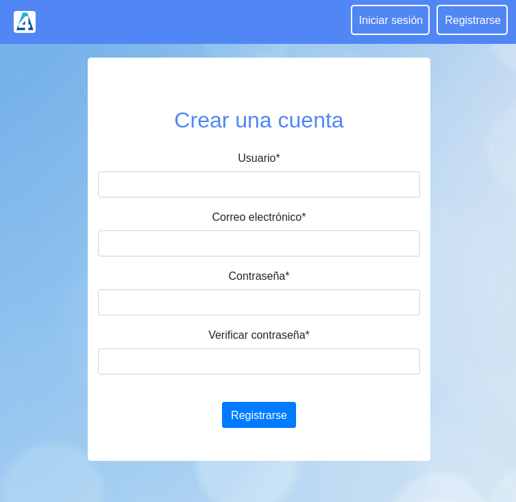
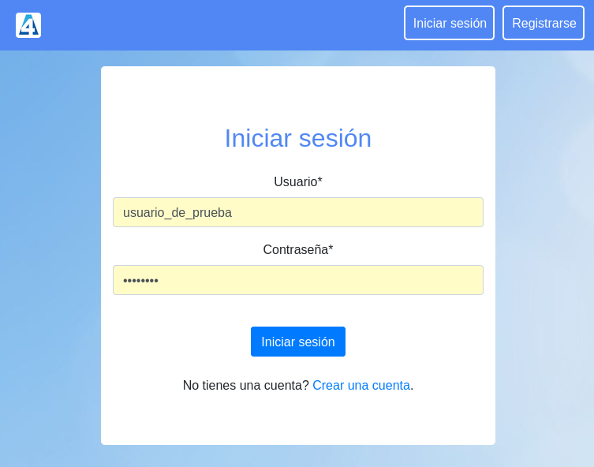
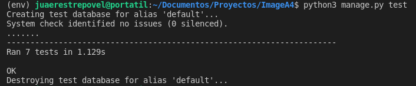
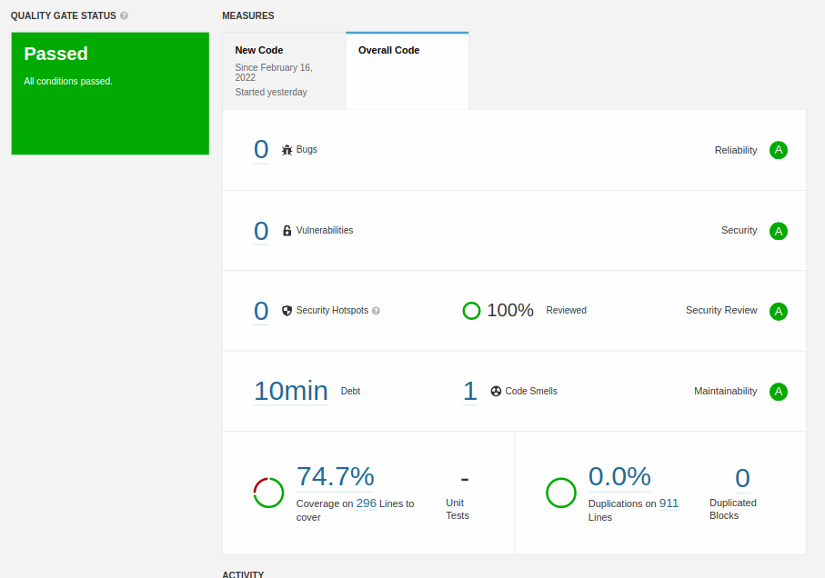
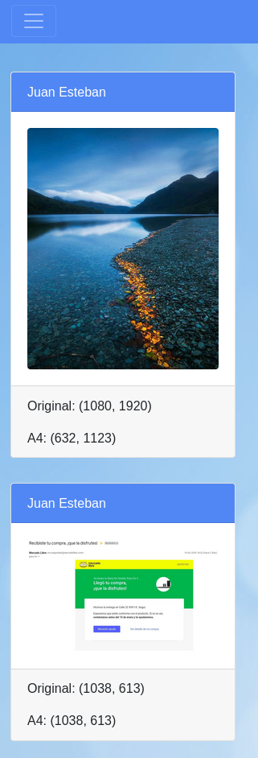
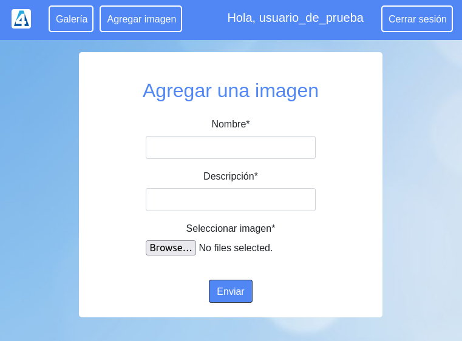
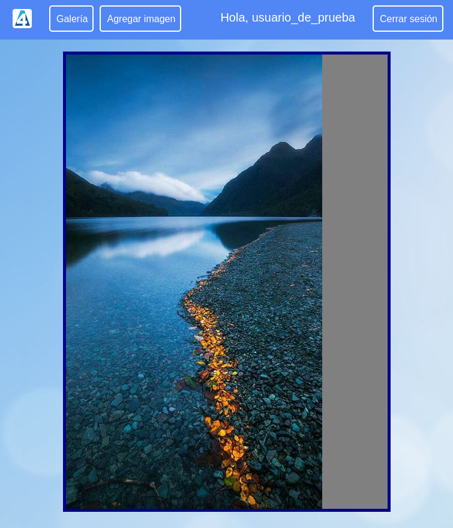
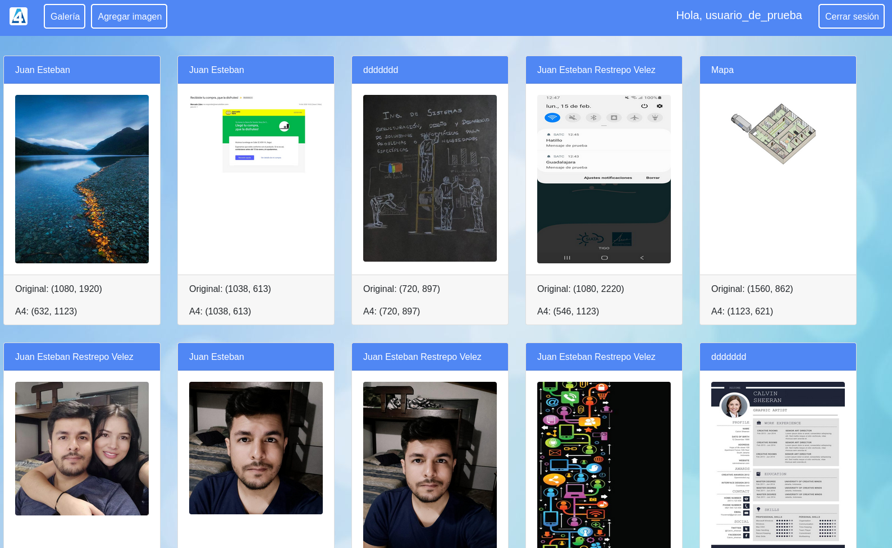

# Proyecto ImageA4

## Funcionamiento de la aplicación

Se redimencionan imágenes en formato JPG de cualquier dimensión (Ancho por alto), con el fin de permitir que la imagen se ajuste al tamaño de una hoja A4 (796 x 1123 pixeles) sin márgenes. El resultado contempla las siguientes características:

- **1.** La imagen no pierde su ratio (Relación de aspecto ancho por alto)
- **2.** Se aprovecha el máximo de la hoja A4
- **3.** La imagen no es agrandada en el proceso, solo encogida cuando corresponda
- **4.** La orientación de la página se define a partir de la orientación de la imagen (Horizontal/Vertical)

## Características no funcionales

- ### Rendimiento y optimización de recursos

Para este componente se diseñó una base de datos relacional en la que se guarda la información necesaria para ubicar las imágenes de manera optima y ágil, se contemplaron los campos (nombre, descripción, ruta, ancho original, alto original, ancho nuevo, alto nuevo).

- ### Seguridad

Se implementó un sistema de registro de usuarios, para relacionar los recursos a cada usuario e impedir que estos sean obtenidos por otros.

- ### Cobertura de pruebas unitarias

Se implementaron pruebas haciendo uso del paquete que trae por defecto python "test", se tuvieron en cuenta los test de verificación en la ejecución de todos los templates, el registro y login de los usuarios y el cambio de la ruta de una imagen para el guardado si ya existe una con la misma ruta.

- ### Índice de deuda técnica

Para determinar el índice de deuda técnica se hizo uso del software **SonarQube**, el cual se integra al proyecto y lo analiza con una gran cantidad de reglas para análisis de código estático, con las cuales evalúa la calidad desde diferentes aspectos como, la cobertura de las pruebas unitarias, duplicación de bloques de código, seguridad al exponer información delicada.

SonarQube usa la metodología **SQALE** (Software Quality Assessment based on Lifecycle Expectations) que mide la distancia a la conformidad de los requisitos considerando el coste de remediar o corregir el código fuente hasta alcanzar la conformidad.

Esta herramienta es muy práctica ya que nos permite mejorar en el proceso para obtener un código más seguro, optimo y limpio.

- ### Código limpio + Clean architecture

- ### Stack usado, lenguaje, librerías

Se desarrolló en el **Lenguaje Python** ya que cuenta con una gran variedad de usos posibles, como, desarrollo web, big data, inteligencia artificial, blockchain, etc. permitiendo escalar la aplicación y obtener algo más complejo, tambien permite crear programas para diferentes plataformas y dispositivos, además lleva varios años en los puestos más altos de los lenguajes más usados y cuenta con una gran comunidad de desarrolladores.

**Framework Django**, este framework cuenta con funcionalidades implementadas por defecto que pueden ayudar a agilizar el desarrollo, ofrece un gran rendimiento y flexibilidad, pudiendo escalar proyectos de forma sencilla, se trabaja bajo el patrón MVT (Model View Template) lo que permite un desarrollo ágil y reutilizable.

**Base de datos PostgreSQL**, es un gestor que trabaja con bases de datos relacionales y está orientado a objetos, es opensource y cuenta con una gran comunidad que trabajan para mejorarlo continuamente. Permite crear tablas heredadas, esquemas y triggers, lo que es de gran ayuda si se piensa escalar la aplicación.

- **Librerías:**
  - **Bootstrap** esta librería facilita el diseño web, permitiendo crear de forma sencilla diseños adptables a cualquier dispositivo, cuenta con plantillas predefinidas consiguiendo que la carga de la página sea rápida y que la navegación sea fluida e intuitiva. Es fácil complementarlo con HTML5, CSS y JavaScript.

  - **Pillow** Es una librería opensource con más de una decada de soporte y actualizaciones que permite anañizar y manipular archivos e imágenes como cambiar tamaño, transparencia, desenfoque, contorno, brillo,etc.

- ### Estrategia de despliegue

La aplicación se probó realizando un despliegue a nivel local en un sistema operativo Linux con distribución Ubuntu, en un ambiente virtual para controlar el versionamiento de las aplicaciones. Sin embargo es posible realizar el despliegue en servidores en la nube ya que son compatibles con todos los recursos necesarios.

- ### Responsive

Se diseñaron templates pensados para todo tipo de dispositivos, haciendo uso de HTML5, CSS y Bootstrap, contemplando los seis puntos de quiebre más comunes (xs, sm, md, lg, xl, xxl) con sus respectivas dimensiones.

## Características funcionales

En la aplicación al registrase e iniciar sesión puede agregar una imágen la cual será analizada y si corresponde al formato adecuado pasará a elegir la orientación de la hoja según la orientación de la imagen y por último determinar si es necesario ajustar su tamaño para que encaje dentro de una hoja A4 (1123, 796), una vez guardada la imagen, dibuja una hoja A4 con fondo gris y sobrepone la imagen para contemplar el reajuste de tamaño.

Tambien se creo una galería de imágenes para facilitar la vista de todas las imágenes guardadas por el usuario, al pasar el cursor sobre las miniaturas se puede dar click a estas para ir a una vista en detalle de la imagen.

